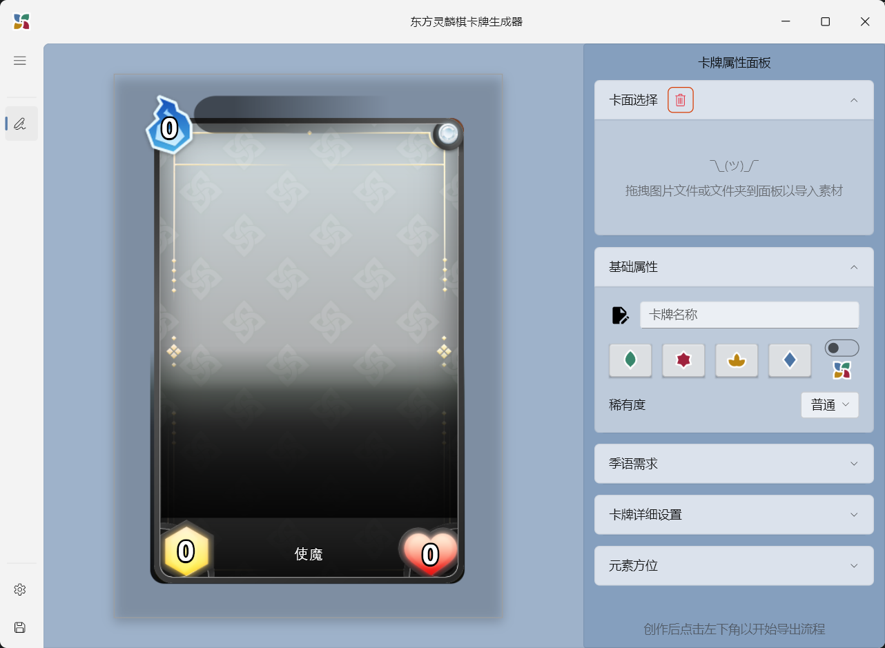
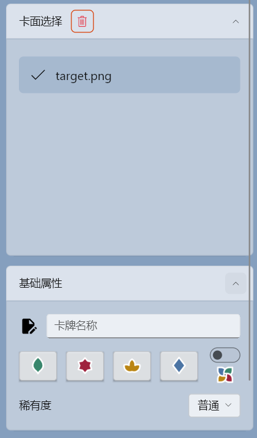
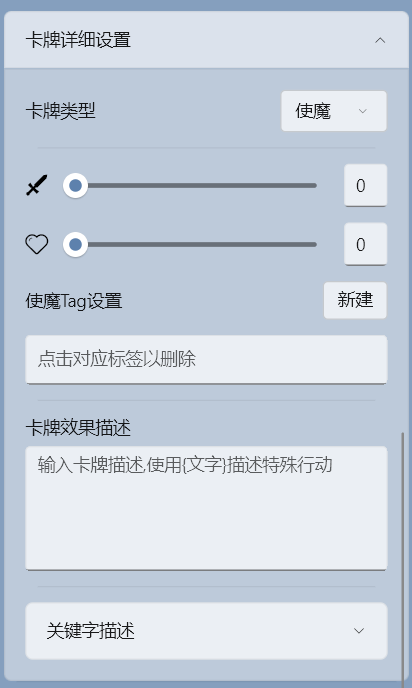
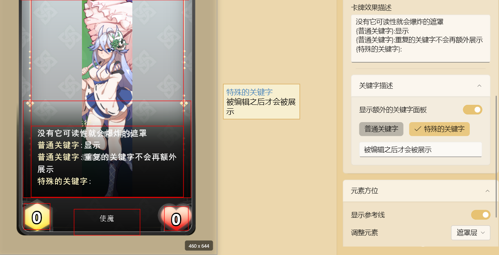
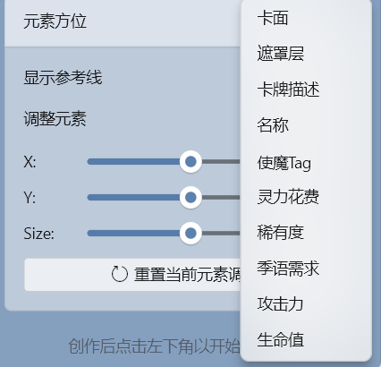

由 Flutter 编写 的 FluentUI(win11) 风格的 《东方灵麟棋》同人diy模板 的 window程序





下载在 [Release](https://github.com/kechuan/luckyBeastCardTemplateGenerator/releases) 处


如果这玩意对你有用 点个 :star: 就最好了。


****


## 功能展示


**信息录入**

| 基础信息               | 详细设置                 |
| ------------------------------- | ----------------------------- |
|  |  |

****


**测试参考线** 与 **关键字面板**



****


**微调与导出**

| 调整方位                          | 导出页面                       |
| --------------------------------- | ------------------------------ |
|  |  |


****


<details>
<summary> <b>作者闲谈</b> </summary>
第一次在flutter里使用 FluentUI  也是第一次使用slang多语言(虽然大概率没人看 不过拿来练手也能接受)


太多的太多的widget的ui特性是未知的 

> 神秘的 navigationView 与 pane ，其view本身居然就能作为一个"material"上下文组件了。。
>
> 真是闻所未闻

但好在大部分的信息传递都还是相同的 widgetState这种 

> 我感觉这种state的传递甚至比 material体系强多了 那边是单组件的设置


接下来是不同点


****


**原子化区分**


material 风格的组件在默认设置下会更加的"紧密"

而fluent ui 的组件则是在默认情况下更为的原子化


这个不仅体现在 theme 的色调传递里

还体现在 widget 的状态刷新里

> 弹出 `comboBox` 的 overlay 时 不会触发rebuild 
>
> 你 material 的 `popupMenuButton` 能做得到吗?


****


**theme信息传递**

在theme方面两者更是大相径庭


在默认设置下 如果你想最方便的搞色调


material 是这么做的

```dart
ThemeData(
	seedColor: context.watch<AppModel>().themeColorType.color
)
```


而 fluent ui 是这么做的

```dart
accentColor: AccentColor.swatch(
  {
    'normal': context.watch<AppModel>().themeColorType.color,
  }
),
```


整这么奇葩是因为 对比起 material 是通过 莫奈色调 算出来的颜色

Fluent UI 则是划分为 7种 明亮色调的设置

**darkest** —— **normal** —— **lightest**

是的 **所有8种** 明亮度的配置 还不是区分色 真给我气笑了


这到底是拿来干嘛的？


答案是用于搭配 state 的不同状态 或者是 widget 的子色调的

> 对的  是对应 **primary**/**secondary**/**Tertiary**这种的设计


不同于 material的计算取色 

fluent ui 的 state 里 **hover**,**Pressed** 实际上都默认指向固定的 `.亮度等级`


你提供了就直接采用 

不提供 就以默认的挡位色差来提供颜色(`AccentColor`)

> 别忘了 默认的 `AccentColor` 无论是material([100]) 还是 fluentUI(.darkest)
>
> 都会提供它的默认亮度值 只是表达的不同


这么看起来 这种设置反而比 上面的 设置(易用度)好点

****


**原子化的朝圣之路**


Fluent ui 在 `FluentTheme.of(context)` 引入了新的属性 **resource** 

其内部包含了极其多的可调整属性


在ide里 **320px** height 的 lint  你显示出来的 滑块thumb 只有 **28px** 这么小


可单独配置的地方多的令人微距

如果前面还只能说是 初显端倪 那到这里真的是不演了。。


</details>
